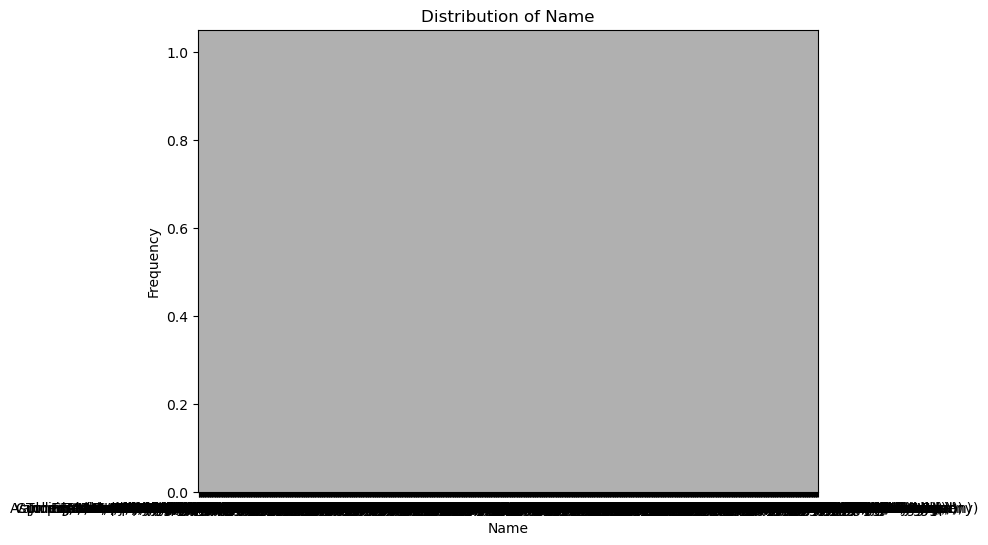
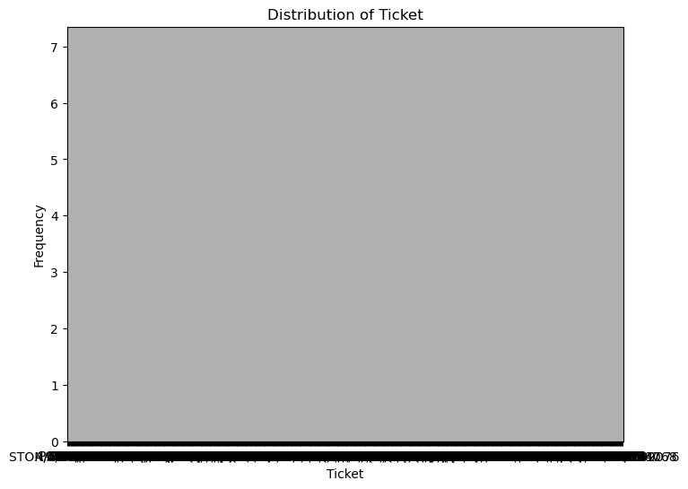
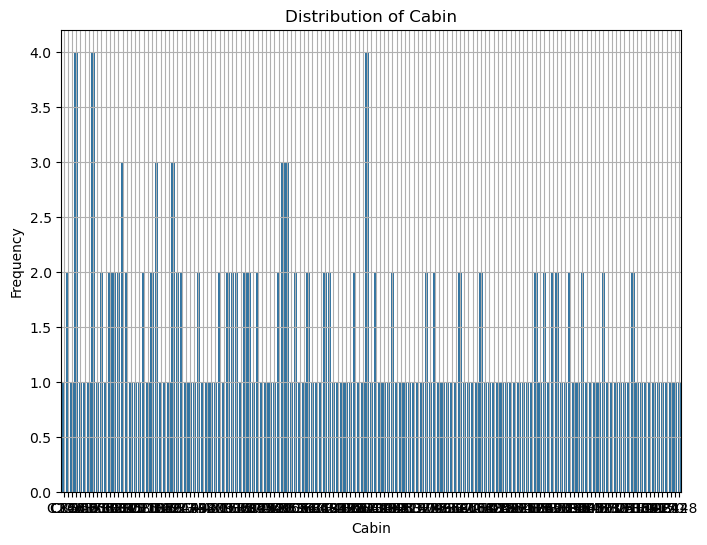
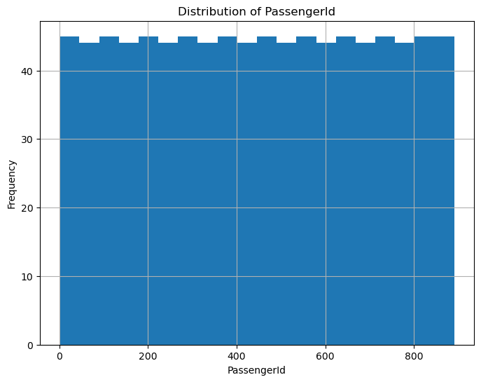

# Titanic

The data is from a beginning Kaggle competition to predict survivors of the famous Titanic disaster. Data of 2224 passengers is split into training and test data sets. The challenge is to develop of model from the training data set provided to predict who survived the Titanic disaster. This model is then used to predict whether a passenger survived in the test data set. 

## Initial review of data
* Age has a large number of missing values. Explore with the possibility of replacing the missing values.
* Cabin has a very large set of missing values. 
* Embarked has 2 missing values. 

### List of variables
* Survival	0 = No, 1 = Yes
* pclass: Ticket class	1 = 1st, 2 = 2nd, 3 = 3rd
* sex	Sex	
* Age	Age in years	
* sibsp	# of siblings / spouses aboard the Titanic	
* parch	# of parents / children aboard the Titanic	
* ticket	Ticket number	
* fare	Passenger fare	
* cabin	Cabin number	
* embarked	Port of Embarkation	C = Cherbourg, Q = Queenstown, S = Southampton

Variable Notes
* pclass: A proxy for socio-economic status (SES) 1st = Upper, 2nd = Middle, 3rd = Lower
* age: Age is fractional if less than 1. If the age is estimated, is it in the form of xx.5
* sibsp: The dataset defines family relations in this way. Sibling = brother, sister, stepbrother, stepsister
* Spouse = husband, wife (mistresses and fiancés were ignored)
* parch: The dataset defines family relations in this way. Parent = mother, father
* Child = daughter, son, stepdaughter, stepson. Some children travelled only with a nanny, therefore parch=0 for them.

### First 10 rows of dataframe

<table border="1" class="dataframe">
  <thead>
    <tr style="text-align: right;">
      <th></th>
      <th>PassengerId</th>
      <th>Survived</th>
      <th>Pclass</th>
      <th>Name</th>
      <th>Sex</th>
      <th>Age</th>
      <th>SibSp</th>
      <th>Parch</th>
      <th>Ticket</th>
      <th>Fare</th>
      <th>Cabin</th>
      <th>Embarked</th>
    </tr>
  </thead>
  <tbody>
    <tr>
      <th>0</th>
      <td>1</td>
      <td>0</td>
      <td>3</td>
      <td>Braund, Mr. Owen Harris</td>
      <td>male</td>
      <td>22.0</td>
      <td>1</td>
      <td>0</td>
      <td>A/5 21171</td>
      <td>7.2500</td>
      <td>NaN</td>
      <td>S</td>
    </tr>
    <tr>
      <th>1</th>
      <td>2</td>
      <td>1</td>
      <td>1</td>
      <td>Cumings, Mrs. John Bradley (Florence Briggs Th...</td>
      <td>female</td>
      <td>38.0</td>
      <td>1</td>
      <td>0</td>
      <td>PC 17599</td>
      <td>71.2833</td>
      <td>C85</td>
      <td>C</td>
    </tr>
    <tr>
      <th>2</th>
      <td>3</td>
      <td>1</td>
      <td>3</td>
      <td>Heikkinen, Miss. Laina</td>
      <td>female</td>
      <td>26.0</td>
      <td>0</td>
      <td>0</td>
      <td>STON/O2. 3101282</td>
      <td>7.9250</td>
      <td>NaN</td>
      <td>S</td>
    </tr>
    <tr>
      <th>3</th>
      <td>4</td>
      <td>1</td>
      <td>1</td>
      <td>Futrelle, Mrs. Jacques Heath (Lily May Peel)</td>
      <td>female</td>
      <td>35.0</td>
      <td>1</td>
      <td>0</td>
      <td>113803</td>
      <td>53.1000</td>
      <td>C123</td>
      <td>S</td>
    </tr>
    <tr>
      <th>4</th>
      <td>5</td>
      <td>0</td>
      <td>3</td>
      <td>Allen, Mr. William Henry</td>
      <td>male</td>
      <td>35.0</td>
      <td>0</td>
      <td>0</td>
      <td>373450</td>
      <td>8.0500</td>
      <td>NaN</td>
      <td>S</td>
    </tr>
    <tr>
      <th>5</th>
      <td>6</td>
      <td>0</td>
      <td>3</td>
      <td>Moran, Mr. James</td>
      <td>male</td>
      <td>NaN</td>
      <td>0</td>
      <td>0</td>
      <td>330877</td>
      <td>8.4583</td>
      <td>NaN</td>
      <td>Q</td>
    </tr>
    <tr>
      <th>6</th>
      <td>7</td>
      <td>0</td>
      <td>1</td>
      <td>McCarthy, Mr. Timothy J</td>
      <td>male</td>
      <td>54.0</td>
      <td>0</td>
      <td>0</td>
      <td>17463</td>
      <td>51.8625</td>
      <td>E46</td>
      <td>S</td>
    </tr>
    <tr>
      <th>7</th>
      <td>8</td>
      <td>0</td>
      <td>3</td>
      <td>Palsson, Master. Gosta Leonard</td>
      <td>male</td>
      <td>2.0</td>
      <td>3</td>
      <td>1</td>
      <td>349909</td>
      <td>21.0750</td>
      <td>NaN</td>
      <td>S</td>
    </tr>
    <tr>
      <th>8</th>
      <td>9</td>
      <td>1</td>
      <td>3</td>
      <td>Johnson, Mrs. Oscar W (Elisabeth Vilhelmina Berg)</td>
      <td>female</td>
      <td>27.0</td>
      <td>0</td>
      <td>2</td>
      <td>347742</td>
      <td>11.1333</td>
      <td>NaN</td>
      <td>S</td>
    </tr>
    <tr>
      <th>9</th>
      <td>10</td>
      <td>1</td>
      <td>2</td>
      <td>Nasser, Mrs. Nicholas (Adele Achem)</td>
      <td>female</td>
      <td>14.0</td>
      <td>1</td>
      <td>0</td>
      <td>237736</td>
      <td>30.0708</td>
      <td>NaN</td>
      <td>C</td>
    </tr>
  </tbody>
</table>
</div>


### Distributions of variables


<table border="1" class="dataframe">
  <thead>
    <tr style="text-align: right;">
      <th></th>
      <th>PassengerId</th>
      <th>Survived</th>
      <th>Pclass</th>
      <th>Name</th>
      <th>Sex</th>
      <th>Age</th>
      <th>SibSp</th>
      <th>Parch</th>
      <th>Ticket</th>
      <th>Fare</th>
      <th>Cabin</th>
      <th>Embarked</th>
    </tr>
  </thead>
  <tbody>
    <tr>
      <th>count</th>
      <td>891.000000</td>
      <td>891.000000</td>
      <td>891.000000</td>
      <td>891</td>
      <td>891</td>
      <td>714.000000</td>
      <td>891.000000</td>
      <td>891.000000</td>
      <td>891</td>
      <td>891.000000</td>
      <td>204</td>
      <td>889</td>
    </tr>
    <tr>
      <th>unique</th>
      <td>NaN</td>
      <td>NaN</td>
      <td>NaN</td>
      <td>891</td>
      <td>2</td>
      <td>NaN</td>
      <td>NaN</td>
      <td>NaN</td>
      <td>681</td>
      <td>NaN</td>
      <td>147</td>
      <td>3</td>
    </tr>
    <tr>
      <th>top</th>
      <td>NaN</td>
      <td>NaN</td>
      <td>NaN</td>
      <td>Braund, Mr. Owen Harris</td>
      <td>male</td>
      <td>NaN</td>
      <td>NaN</td>
      <td>NaN</td>
      <td>347082</td>
      <td>NaN</td>
      <td>B96 B98</td>
      <td>S</td>
    </tr>
    <tr>
      <th>freq</th>
      <td>NaN</td>
      <td>NaN</td>
      <td>NaN</td>
      <td>1</td>
      <td>577</td>
      <td>NaN</td>
      <td>NaN</td>
      <td>NaN</td>
      <td>7</td>
      <td>NaN</td>
      <td>4</td>
      <td>644</td>
    </tr>
    <tr>
      <th>mean</th>
      <td>446.000000</td>
      <td>0.383838</td>
      <td>2.308642</td>
      <td>NaN</td>
      <td>NaN</td>
      <td>29.699118</td>
      <td>0.523008</td>
      <td>0.381594</td>
      <td>NaN</td>
      <td>32.204208</td>
      <td>NaN</td>
      <td>NaN</td>
    </tr>
    <tr>
      <th>std</th>
      <td>257.353842</td>
      <td>0.486592</td>
      <td>0.836071</td>
      <td>NaN</td>
      <td>NaN</td>
      <td>14.526497</td>
      <td>1.102743</td>
      <td>0.806057</td>
      <td>NaN</td>
      <td>49.693429</td>
      <td>NaN</td>
      <td>NaN</td>
    </tr>
    <tr>
      <th>min</th>
      <td>1.000000</td>
      <td>0.000000</td>
      <td>1.000000</td>
      <td>NaN</td>
      <td>NaN</td>
      <td>0.420000</td>
      <td>0.000000</td>
      <td>0.000000</td>
      <td>NaN</td>
      <td>0.000000</td>
      <td>NaN</td>
      <td>NaN</td>
    </tr>
    <tr>
      <th>25%</th>
      <td>223.500000</td>
      <td>0.000000</td>
      <td>2.000000</td>
      <td>NaN</td>
      <td>NaN</td>
      <td>20.125000</td>
      <td>0.000000</td>
      <td>0.000000</td>
      <td>NaN</td>
      <td>7.910400</td>
      <td>NaN</td>
      <td>NaN</td>
    </tr>
    <tr>
      <th>50%</th>
      <td>446.000000</td>
      <td>0.000000</td>
      <td>3.000000</td>
      <td>NaN</td>
      <td>NaN</td>
      <td>28.000000</td>
      <td>0.000000</td>
      <td>0.000000</td>
      <td>NaN</td>
      <td>14.454200</td>
      <td>NaN</td>
      <td>NaN</td>
    </tr>
    <tr>
      <th>75%</th>
      <td>668.500000</td>
      <td>1.000000</td>
      <td>3.000000</td>
      <td>NaN</td>
      <td>NaN</td>
      <td>38.000000</td>
      <td>1.000000</td>
      <td>0.000000</td>
      <td>NaN</td>
      <td>31.000000</td>
      <td>NaN</td>
      <td>NaN</td>
    </tr>
    <tr>
      <th>max</th>
      <td>891.000000</td>
      <td>1.000000</td>
      <td>3.000000</td>
      <td>NaN</td>
      <td>NaN</td>
      <td>80.000000</td>
      <td>8.000000</td>
      <td>6.000000</td>
      <td>NaN</td>
      <td>512.329200</td>
      <td>NaN</td>
      <td>NaN</td>
    </tr>
  </tbody>
</table>
</div>

| Model | Accuracy | Notes |
| --- | --- | --- |
| logistic regression | 0.76794 | |
| logistic regression w/ tuning| 0.78229 | |
| random forest | 0.76076 | |
| random forest w/ tuning | 0.76794 | |
| k nearest neighbor | 0.77511 | Highest accuracy for K=5 |
| support vector machine | 0.77272 | |
| support vector machine w/ tuning | 0.75358 | |


```python
titanic.describe(include="all")
```


<div>
<style scoped>
    .dataframe tbody tr th:only-of-type {
        vertical-align: middle;
    }

    .dataframe tbody tr th {
        vertical-align: top;
    }

    .dataframe thead th {
        text-align: right;
    }
</style>
<table border="1" class="dataframe">
  <thead>
    <tr style="text-align: right;">
      <th></th>
      <th>PassengerId</th>
      <th>Survived</th>
      <th>Pclass</th>
      <th>Name</th>
      <th>Sex</th>
      <th>Age</th>
      <th>SibSp</th>
      <th>Parch</th>
      <th>Ticket</th>
      <th>Fare</th>
      <th>Cabin</th>
      <th>Embarked</th>
    </tr>
  </thead>
  <tbody>
    <tr>
      <th>count</th>
      <td>891.000000</td>
      <td>891.000000</td>
      <td>891.000000</td>
      <td>891</td>
      <td>891</td>
      <td>714.000000</td>
      <td>891.000000</td>
      <td>891.000000</td>
      <td>891</td>
      <td>891.000000</td>
      <td>204</td>
      <td>889</td>
    </tr>
    <tr>
      <th>unique</th>
      <td>NaN</td>
      <td>NaN</td>
      <td>NaN</td>
      <td>891</td>
      <td>2</td>
      <td>NaN</td>
      <td>NaN</td>
      <td>NaN</td>
      <td>681</td>
      <td>NaN</td>
      <td>147</td>
      <td>3</td>
    </tr>
    <tr>
      <th>top</th>
      <td>NaN</td>
      <td>NaN</td>
      <td>NaN</td>
      <td>Braund, Mr. Owen Harris</td>
      <td>male</td>
      <td>NaN</td>
      <td>NaN</td>
      <td>NaN</td>
      <td>347082</td>
      <td>NaN</td>
      <td>B96 B98</td>
      <td>S</td>
    </tr>
    <tr>
      <th>freq</th>
      <td>NaN</td>
      <td>NaN</td>
      <td>NaN</td>
      <td>1</td>
      <td>577</td>
      <td>NaN</td>
      <td>NaN</td>
      <td>NaN</td>
      <td>7</td>
      <td>NaN</td>
      <td>4</td>
      <td>644</td>
    </tr>
    <tr>
      <th>mean</th>
      <td>446.000000</td>
      <td>0.383838</td>
      <td>2.308642</td>
      <td>NaN</td>
      <td>NaN</td>
      <td>29.699118</td>
      <td>0.523008</td>
      <td>0.381594</td>
      <td>NaN</td>
      <td>32.204208</td>
      <td>NaN</td>
      <td>NaN</td>
    </tr>
    <tr>
      <th>std</th>
      <td>257.353842</td>
      <td>0.486592</td>
      <td>0.836071</td>
      <td>NaN</td>
      <td>NaN</td>
      <td>14.526497</td>
      <td>1.102743</td>
      <td>0.806057</td>
      <td>NaN</td>
      <td>49.693429</td>
      <td>NaN</td>
      <td>NaN</td>
    </tr>
    <tr>
      <th>min</th>
      <td>1.000000</td>
      <td>0.000000</td>
      <td>1.000000</td>
      <td>NaN</td>
      <td>NaN</td>
      <td>0.420000</td>
      <td>0.000000</td>
      <td>0.000000</td>
      <td>NaN</td>
      <td>0.000000</td>
      <td>NaN</td>
      <td>NaN</td>
    </tr>
    <tr>
      <th>25%</th>
      <td>223.500000</td>
      <td>0.000000</td>
      <td>2.000000</td>
      <td>NaN</td>
      <td>NaN</td>
      <td>20.125000</td>
      <td>0.000000</td>
      <td>0.000000</td>
      <td>NaN</td>
      <td>7.910400</td>
      <td>NaN</td>
      <td>NaN</td>
    </tr>
    <tr>
      <th>50%</th>
      <td>446.000000</td>
      <td>0.000000</td>
      <td>3.000000</td>
      <td>NaN</td>
      <td>NaN</td>
      <td>28.000000</td>
      <td>0.000000</td>
      <td>0.000000</td>
      <td>NaN</td>
      <td>14.454200</td>
      <td>NaN</td>
      <td>NaN</td>
    </tr>
    <tr>
      <th>75%</th>
      <td>668.500000</td>
      <td>1.000000</td>
      <td>3.000000</td>
      <td>NaN</td>
      <td>NaN</td>
      <td>38.000000</td>
      <td>1.000000</td>
      <td>0.000000</td>
      <td>NaN</td>
      <td>31.000000</td>
      <td>NaN</td>
      <td>NaN</td>
    </tr>
    <tr>
      <th>max</th>
      <td>891.000000</td>
      <td>1.000000</td>
      <td>3.000000</td>
      <td>NaN</td>
      <td>NaN</td>
      <td>80.000000</td>
      <td>8.000000</td>
      <td>6.000000</td>
      <td>NaN</td>
      <td>512.329200</td>
      <td>NaN</td>
      <td>NaN</td>
    </tr>
  </tbody>
</table>
</div>


```python
# Iterate over numeric columns in the 'titanic' DataFrame
for column in titanic.select_dtypes(include=['object']).columns:
        plt.figure(figsize=(8, 6))  # Adjust figure size as needed
        sns.countplot(x=titanic[column])
        plt.title(f'Distribution of {column}')
        plt.xlabel(column)
        plt.ylabel('Frequency')
        plt.grid(True)
        plt.show()
```


    

    


    

    


    

    


    

    


    

    


```python
# Iterate over numeric columns in the 'titanic' DataFrame
for column in titanic.select_dtypes(include=['number']).columns:
        plt.figure(figsize=(8, 6))  # Adjust figure size as needed
        plt.hist(titanic[column], bins=20)  # Corrected reference to 'titanic'
        plt.title(f'Distribution of {column}')
        plt.xlabel(column)
        plt.ylabel('Frequency')
        plt.grid(True)
        plt.show()
```


    

    


    

    


    

    


    

    


    

    


    

    


    

    


```python
missing_values=titanic.isnull().sum()
print(missing_values)
```

    PassengerId      0
    Survived         0
    Pclass           0
    Name             0
    Sex              0
    Age            177
    SibSp            0
    Parch            0
    Ticket           0
    Fare             0
    Cabin          687
    Embarked         2
    dtype: int64
    


```python
titanic.info()
```

    <class 'pandas.core.frame.DataFrame'>
    RangeIndex: 891 entries, 0 to 890
    Data columns (total 12 columns):
     #   Column       Non-Null Count  Dtype  
    ---  ------       --------------  -----  
     0   PassengerId  891 non-null    int64  
     1   Survived     891 non-null    int64  
     2   Pclass       891 non-null    int64  
     3   Name         891 non-null    object 
     4   Sex          891 non-null    object 
     5   Age          714 non-null    float64
     6   SibSp        891 non-null    int64  
     7   Parch        891 non-null    int64  
     8   Ticket       891 non-null    object 
     9   Fare         891 non-null    float64
     10  Cabin        204 non-null    object 
     11  Embarked     889 non-null    object 
    dtypes: float64(2), int64(5), object(5)
    memory usage: 83.7+ KB
    


```python
# Age has a large number of missing values. Explore with the possibility of replacing the missing values.
# Cabin has a very large set of missing values. Explore what the meaning is in historical context.
# Embarked has 2 missing values. 
```


```python
# First explore whether we should replace missing values of age based on sex. The analysis suggests we should.
sns.boxplot(x='Sex', y='Age', data=titanic)
plt.show()
```


    

    


```python
#Replace missing values of age with mean by sex.
# Fill NaN values with the mean of their respective groups
titanic['Age'] = titanic['Age'].fillna(titanic.groupby('Sex')['Age'].transform('mean'))
```


```python
# Those assigned a cabin were much more likely to survive than those that were not.
# Recode missing values
titanic['Cabinassign'] = np.where(pd.isna(titanic['Cabin']), 0, 1)
crosstab = pd.crosstab(titanic['Cabinassign'], titanic['Survived'], normalize='index')
print(crosstab)
```

    Survived            0         1
    Cabinassign                    
    0            0.700146  0.299854
    1            0.333333  0.666667
    


```python
# Passengers who embarked from Cherbourg (C) were more likely to survive than those embraking from Queenstown (Q)
# or Southahmpton(S).
crosstab = pd.crosstab(titanic['Embarked'], titanic['Survived'], normalize='index')
print(crosstab)
```

    Survived         0         1
    Embarked                    
    C         0.446429  0.553571
    Q         0.610390  0.389610
    S         0.663043  0.336957
    


```python
# Passengers who embarked from Cherbourg (C) were more likely to survive than those embraking from Queenstown (Q)
# or Southahmpton(S). Recode into dummy variable to reflect Cherbourg with value of 1 and others with value of 0.

titanic['Cherbourg'] = titanic['Embarked'].replace({'C': 1, 'Q': 0, 'S': 0})
```


```python
# Passengers in first were more likely to survive than those in second class. Passengers in second class were more 
# likely to survive than those in third class. 
table=pd.crosstab(titanic['Pclass'], titanic['Survived'], normalize='index')
print(table)
```

    Survived         0         1
    Pclass                      
    1         0.370370  0.629630
    2         0.527174  0.472826
    3         0.757637  0.242363
    


```python
# Graph showing interaction between sex and class and survival. 
sns.barplot(x='Pclass', y='Survived', hue='Sex', data=titanic)
plt.show()

```


    

    


```python
# Higher fares predicted greater survival.
sns.boxplot(x='Survived', y='Fare', data=titanic)
plt.show()
```


    

    


```python
#Those who survived had fewer siblings and spouses but more parents / children. 
sns.boxplot(data=titanic, x='Survived', y='SibSp')
plt.show()
sns.boxplot(data=titanic, x='Survived', y='Parch')
plt.show()
```


    

    


    

    


```python
# Is there an interaction effect between the variables of SibSp and Parch. The heat map suggests not.
table2=pd.crosstab(titanic['SibSp'], titanic['Parch'], values=titanic['Survived'], aggfunc='mean')
print(table2)
```

    Parch         0         1         2         3    4         5    6
    SibSp                                                            
    0      0.303538  0.657895  0.724138  1.000000  0.0  0.000000  NaN
    1      0.520325  0.596491  0.631579  0.333333  0.0  0.333333  0.0
    2      0.250000  0.857143  0.500000  1.000000  NaN       NaN  NaN
    3      1.000000  0.000000  0.285714       NaN  NaN       NaN  NaN
    4           NaN  0.000000  0.333333       NaN  NaN       NaN  NaN
    5           NaN       NaN  0.000000       NaN  NaN       NaN  NaN
    8           NaN       NaN  0.000000       NaN  NaN       NaN  NaN
    


```python
sns.heatmap(table2, cmap='coolwarm', annot=True)
```


    <Axes: xlabel='Parch', ylabel='SibSp'>


    

    


```python
#Examine relationship between age and surviving.
# Create bins using pd.cut
titanic['bins'] = pd.cut(titanic['Age'], bins=10)

# Plot the bar chart
sns.barplot(x='bins', y='Survived', data=titanic, estimator='mean')
plt.show()
```


    

    


```python
# It looks like the very young and very old are more likely to survive but the highest category of age has only one case.
crosstab = pd.crosstab(titanic['bins'], titanic['Survived'])
print(crosstab)
```

    Survived            0    1
    bins                      
    (0.34, 8.378]      18   36
    (8.378, 16.336]    27   19
    (16.336, 24.294]  114   63
    (24.294, 32.252]  229  117
    (32.252, 40.21]    66   52
    (40.21, 48.168]    46   24
    (48.168, 56.126]   24   21
    (56.126, 64.084]   15    9
    (64.084, 72.042]    9    0
    (72.042, 80.0]      1    1
    


```python
crosstab = pd.crosstab(titanic['bins'], titanic['Survived'], normalize='index')
print(crosstab)
```

    Survived                 0         1
    bins                                
    (0.34, 8.378]     0.333333  0.666667
    (8.378, 16.336]   0.586957  0.413043
    (16.336, 24.294]  0.644068  0.355932
    (24.294, 32.252]  0.661850  0.338150
    (32.252, 40.21]   0.559322  0.440678
    (40.21, 48.168]   0.657143  0.342857
    (48.168, 56.126]  0.533333  0.466667
    (56.126, 64.084]  0.625000  0.375000
    (64.084, 72.042]  1.000000  0.000000
    (72.042, 80.0]    0.500000  0.500000
    


```python
titanic.info()
```

    <class 'pandas.core.frame.DataFrame'>
    RangeIndex: 891 entries, 0 to 890
    Data columns (total 15 columns):
     #   Column       Non-Null Count  Dtype   
    ---  ------       --------------  -----   
     0   PassengerId  891 non-null    int64   
     1   Survived     891 non-null    int64   
     2   Pclass       891 non-null    int64   
     3   Name         891 non-null    object  
     4   Sex          891 non-null    object  
     5   Age          891 non-null    float64 
     6   SibSp        891 non-null    int64   
     7   Parch        891 non-null    int64   
     8   Ticket       891 non-null    object  
     9   Fare         891 non-null    float64 
     10  Cabin        204 non-null    object  
     11  Embarked     889 non-null    object  
     12  Cabinassign  891 non-null    int32   
     13  Cherbourg    889 non-null    float64 
     14  bins         891 non-null    category
    dtypes: category(1), float64(3), int32(1), int64(5), object(5)
    memory usage: 95.4+ KB
    


```python
# Specify the bin you want to recode as 1

def recode_variable(Age):
    if Age >= 0.34 and Age <= 8.378:
        return 1
    else:
        return 0

# Apply function to 'Age' column
titanic['child'] = titanic['Age'].apply(recode_variable)

titanic.head(10)

```


<div>
<style scoped>
    .dataframe tbody tr th:only-of-type {
        vertical-align: middle;
    }

    .dataframe tbody tr th {
        vertical-align: top;
    }

    .dataframe thead th {
        text-align: right;
    }
</style>
<table border="1" class="dataframe">
  <thead>
    <tr style="text-align: right;">
      <th></th>
      <th>PassengerId</th>
      <th>Survived</th>
      <th>Pclass</th>
      <th>Name</th>
      <th>Sex</th>
      <th>Age</th>
      <th>SibSp</th>
      <th>Parch</th>
      <th>Ticket</th>
      <th>Fare</th>
      <th>Cabin</th>
      <th>Embarked</th>
      <th>Cabinassign</th>
      <th>Cherbourg</th>
      <th>bins</th>
      <th>child</th>
    </tr>
  </thead>
  <tbody>
    <tr>
      <th>0</th>
      <td>1</td>
      <td>0</td>
      <td>3</td>
      <td>Braund, Mr. Owen Harris</td>
      <td>male</td>
      <td>22.000000</td>
      <td>1</td>
      <td>0</td>
      <td>A/5 21171</td>
      <td>7.2500</td>
      <td>NaN</td>
      <td>S</td>
      <td>0</td>
      <td>0.0</td>
      <td>(16.336, 24.294]</td>
      <td>0</td>
    </tr>
    <tr>
      <th>1</th>
      <td>2</td>
      <td>1</td>
      <td>1</td>
      <td>Cumings, Mrs. John Bradley (Florence Briggs Th...</td>
      <td>female</td>
      <td>38.000000</td>
      <td>1</td>
      <td>0</td>
      <td>PC 17599</td>
      <td>71.2833</td>
      <td>C85</td>
      <td>C</td>
      <td>1</td>
      <td>1.0</td>
      <td>(32.252, 40.21]</td>
      <td>0</td>
    </tr>
    <tr>
      <th>2</th>
      <td>3</td>
      <td>1</td>
      <td>3</td>
      <td>Heikkinen, Miss. Laina</td>
      <td>female</td>
      <td>26.000000</td>
      <td>0</td>
      <td>0</td>
      <td>STON/O2. 3101282</td>
      <td>7.9250</td>
      <td>NaN</td>
      <td>S</td>
      <td>0</td>
      <td>0.0</td>
      <td>(24.294, 32.252]</td>
      <td>0</td>
    </tr>
    <tr>
      <th>3</th>
      <td>4</td>
      <td>1</td>
      <td>1</td>
      <td>Futrelle, Mrs. Jacques Heath (Lily May Peel)</td>
      <td>female</td>
      <td>35.000000</td>
      <td>1</td>
      <td>0</td>
      <td>113803</td>
      <td>53.1000</td>
      <td>C123</td>
      <td>S</td>
      <td>1</td>
      <td>0.0</td>
      <td>(32.252, 40.21]</td>
      <td>0</td>
    </tr>
    <tr>
      <th>4</th>
      <td>5</td>
      <td>0</td>
      <td>3</td>
      <td>Allen, Mr. William Henry</td>
      <td>male</td>
      <td>35.000000</td>
      <td>0</td>
      <td>0</td>
      <td>373450</td>
      <td>8.0500</td>
      <td>NaN</td>
      <td>S</td>
      <td>0</td>
      <td>0.0</td>
      <td>(32.252, 40.21]</td>
      <td>0</td>
    </tr>
    <tr>
      <th>5</th>
      <td>6</td>
      <td>0</td>
      <td>3</td>
      <td>Moran, Mr. James</td>
      <td>male</td>
      <td>30.726645</td>
      <td>0</td>
      <td>0</td>
      <td>330877</td>
      <td>8.4583</td>
      <td>NaN</td>
      <td>Q</td>
      <td>0</td>
      <td>0.0</td>
      <td>(24.294, 32.252]</td>
      <td>0</td>
    </tr>
    <tr>
      <th>6</th>
      <td>7</td>
      <td>0</td>
      <td>1</td>
      <td>McCarthy, Mr. Timothy J</td>
      <td>male</td>
      <td>54.000000</td>
      <td>0</td>
      <td>0</td>
      <td>17463</td>
      <td>51.8625</td>
      <td>E46</td>
      <td>S</td>
      <td>1</td>
      <td>0.0</td>
      <td>(48.168, 56.126]</td>
      <td>0</td>
    </tr>
    <tr>
      <th>7</th>
      <td>8</td>
      <td>0</td>
      <td>3</td>
      <td>Palsson, Master. Gosta Leonard</td>
      <td>male</td>
      <td>2.000000</td>
      <td>3</td>
      <td>1</td>
      <td>349909</td>
      <td>21.0750</td>
      <td>NaN</td>
      <td>S</td>
      <td>0</td>
      <td>0.0</td>
      <td>(0.34, 8.378]</td>
      <td>1</td>
    </tr>
    <tr>
      <th>8</th>
      <td>9</td>
      <td>1</td>
      <td>3</td>
      <td>Johnson, Mrs. Oscar W (Elisabeth Vilhelmina Berg)</td>
      <td>female</td>
      <td>27.000000</td>
      <td>0</td>
      <td>2</td>
      <td>347742</td>
      <td>11.1333</td>
      <td>NaN</td>
      <td>S</td>
      <td>0</td>
      <td>0.0</td>
      <td>(24.294, 32.252]</td>
      <td>0</td>
    </tr>
    <tr>
      <th>9</th>
      <td>10</td>
      <td>1</td>
      <td>2</td>
      <td>Nasser, Mrs. Nicholas (Adele Achem)</td>
      <td>female</td>
      <td>14.000000</td>
      <td>1</td>
      <td>0</td>
      <td>237736</td>
      <td>30.0708</td>
      <td>NaN</td>
      <td>C</td>
      <td>0</td>
      <td>1.0</td>
      <td>(8.378, 16.336]</td>
      <td>0</td>
    </tr>
  </tbody>
</table>
</div>


```python
titanic['Sex_numeric'] = titanic['Sex'].replace({'male': 0, 'female': 1})
titanic.info()
```

    <class 'pandas.core.frame.DataFrame'>
    RangeIndex: 891 entries, 0 to 890
    Data columns (total 30 columns):
     #   Column       Non-Null Count  Dtype   
    ---  ------       --------------  -----   
     0   PassengerId  891 non-null    int64   
     1   Survived     891 non-null    int64   
     2   Pclass       891 non-null    int64   
     3   Name         891 non-null    object  
     4   Sex          891 non-null    object  
     5   Age          891 non-null    float64 
     6   SibSp        891 non-null    int64   
     7   Parch        891 non-null    int64   
     8   Ticket       891 non-null    object  
     9   Fare         891 non-null    float64 
     10  Cabin        204 non-null    object  
     11  Embarked     889 non-null    object  
     12  Cabinassign  891 non-null    int32   
     13  Cherbourg    889 non-null    float64 
     14  bins         891 non-null    category
     15  child        891 non-null    int64   
     16  Sex_numeric  891 non-null    int64   
     17  ClassSex     891 non-null    int64   
     18  ClassSex_5   891 non-null    bool    
     19  ClassSex_6   891 non-null    bool    
     20  ClassSex_8   891 non-null    bool    
     21  ClassSex_9   891 non-null    bool    
     22  ClassSex_11  891 non-null    bool    
     23  ClassSex_12  891 non-null    bool    
     24  ClassSex_5   891 non-null    bool    
     25  ClassSex_6   891 non-null    bool    
     26  ClassSex_8   891 non-null    bool    
     27  ClassSex_9   891 non-null    bool    
     28  ClassSex_11  891 non-null    bool    
     29  ClassSex_12  891 non-null    bool    
    dtypes: bool(12), category(1), float64(3), int32(1), int64(8), object(5)
    memory usage: 126.7+ KB
    


```python
titanic['ClassSex'] =  titanic['Sex'].astype(str) + '_' + titanic['Pclass'].astype(str)

# Step 2: Create dummy variables for the combined variable
dummies = pd.get_dummies(titanic['ClassSex'], prefix='ClassSex')

# Step 3: Combine the dummy variables back to the original DataFrame
titanic = pd.concat([titanic, dummies], axis=1)

titanic.info()
```

    <class 'pandas.core.frame.DataFrame'>
    Index: 889 entries, 0 to 890
    Data columns (total 42 columns):
     #   Column             Non-Null Count  Dtype   
    ---  ------             --------------  -----   
     0   PassengerId        889 non-null    int64   
     1   Survived           889 non-null    int64   
     2   Pclass             889 non-null    int64   
     3   Name               889 non-null    object  
     4   Sex                889 non-null    object  
     5   Age                889 non-null    float64 
     6   SibSp              889 non-null    int64   
     7   Parch              889 non-null    int64   
     8   Ticket             889 non-null    object  
     9   Fare               889 non-null    float64 
     10  Cabin              202 non-null    object  
     11  Embarked           889 non-null    object  
     12  Cabinassign        889 non-null    int32   
     13  Cherbourg          889 non-null    float64 
     14  bins               889 non-null    category
     15  child              889 non-null    int64   
     16  Sex_numeric        889 non-null    int64   
     17  ClassSex           889 non-null    object  
     18  ClassSex_5         889 non-null    bool    
     19  ClassSex_6         889 non-null    bool    
     20  ClassSex_8         889 non-null    bool    
     21  ClassSex_9         889 non-null    bool    
     22  ClassSex_11        889 non-null    bool    
     23  ClassSex_12        889 non-null    bool    
     24  ClassSex_5         889 non-null    bool    
     25  ClassSex_6         889 non-null    bool    
     26  ClassSex_8         889 non-null    bool    
     27  ClassSex_9         889 non-null    bool    
     28  ClassSex_11        889 non-null    bool    
     29  ClassSex_12        889 non-null    bool    
     30  ClassSex_5         889 non-null    bool    
     31  ClassSex_6         889 non-null    bool    
     32  ClassSex_8         889 non-null    bool    
     33  ClassSex_9         889 non-null    bool    
     34  ClassSex_11        889 non-null    bool    
     35  ClassSex_12        889 non-null    bool    
     36  ClassSex_female_1  889 non-null    bool    
     37  ClassSex_female_2  889 non-null    bool    
     38  ClassSex_female_3  889 non-null    bool    
     39  ClassSex_male_1    889 non-null    bool    
     40  ClassSex_male_2    889 non-null    bool    
     41  ClassSex_male_3    889 non-null    bool    
    dtypes: bool(24), category(1), float64(3), int32(1), int64(7), object(6)
    memory usage: 143.7+ KB
    


```python
missing_values=titanic.isnull().sum()
print(missing_values)
titanic.info()
```

    PassengerId            0
    Survived               0
    Pclass                 0
    Name                   0
    Sex                    0
    Age                    0
    SibSp                  0
    Parch                  0
    Ticket                 0
    Fare                   0
    Cabin                687
    Embarked               0
    Cabinassign            0
    Cherbourg              0
    bins                   0
    child                  0
    Sex_numeric            0
    ClassSex               0
    ClassSex_5             0
    ClassSex_6             0
    ClassSex_8             0
    ClassSex_9             0
    ClassSex_11            0
    ClassSex_12            0
    ClassSex_5             0
    ClassSex_6             0
    ClassSex_8             0
    ClassSex_9             0
    ClassSex_11            0
    ClassSex_12            0
    ClassSex_5             0
    ClassSex_6             0
    ClassSex_8             0
    ClassSex_9             0
    ClassSex_11            0
    ClassSex_12            0
    ClassSex_female_1      0
    ClassSex_female_2      0
    ClassSex_female_3      0
    ClassSex_male_1        0
    ClassSex_male_2        0
    ClassSex_male_3        0
    dtype: int64
    <class 'pandas.core.frame.DataFrame'>
    Index: 889 entries, 0 to 890
    Data columns (total 42 columns):
     #   Column             Non-Null Count  Dtype   
    ---  ------             --------------  -----   
     0   PassengerId        889 non-null    int64   
     1   Survived           889 non-null    int64   
     2   Pclass             889 non-null    int64   
     3   Name               889 non-null    object  
     4   Sex                889 non-null    object  
     5   Age                889 non-null    float64 
     6   SibSp              889 non-null    int64   
     7   Parch              889 non-null    int64   
     8   Ticket             889 non-null    object  
     9   Fare               889 non-null    float64 
     10  Cabin              202 non-null    object  
     11  Embarked           889 non-null    object  
     12  Cabinassign        889 non-null    int32   
     13  Cherbourg          889 non-null    float64 
     14  bins               889 non-null    category
     15  child              889 non-null    int64   
     16  Sex_numeric        889 non-null    int64   
     17  ClassSex           889 non-null    object  
     18  ClassSex_5         889 non-null    bool    
     19  ClassSex_6         889 non-null    bool    
     20  ClassSex_8         889 non-null    bool    
     21  ClassSex_9         889 non-null    bool    
     22  ClassSex_11        889 non-null    bool    
     23  ClassSex_12        889 non-null    bool    
     24  ClassSex_5         889 non-null    bool    
     25  ClassSex_6         889 non-null    bool    
     26  ClassSex_8         889 non-null    bool    
     27  ClassSex_9         889 non-null    bool    
     28  ClassSex_11        889 non-null    bool    
     29  ClassSex_12        889 non-null    bool    
     30  ClassSex_5         889 non-null    bool    
     31  ClassSex_6         889 non-null    bool    
     32  ClassSex_8         889 non-null    bool    
     33  ClassSex_9         889 non-null    bool    
     34  ClassSex_11        889 non-null    bool    
     35  ClassSex_12        889 non-null    bool    
     36  ClassSex_female_1  889 non-null    bool    
     37  ClassSex_female_2  889 non-null    bool    
     38  ClassSex_female_3  889 non-null    bool    
     39  ClassSex_male_1    889 non-null    bool    
     40  ClassSex_male_2    889 non-null    bool    
     41  ClassSex_male_3    889 non-null    bool    
    dtypes: bool(24), category(1), float64(3), int32(1), int64(7), object(6)
    memory usage: 143.7+ KB
    


```python
titanic = titanic.dropna(subset=['Cherbourg'])
```


```python
#The model should include the Survived, Pclass, Sex_code, Sibsp, Parch, Fare, Cabinassign_code, Cherbourg, child, 'ClassSex_5', ClassSex_6', 'ClassSex_8', 'ClassSex_9', 'ClassSex_11', 'ClassSex_12' 
```


```python
import pandas as pd
from sklearn.model_selection import train_test_split
from sklearn.linear_model import LogisticRegression
from sklearn.metrics import confusion_matrix, accuracy_score
from sklearn.preprocessing import StandardScaler

subset_df1 = titanic[['Survived', 'Pclass', 'Sex_numeric', 'Parch', 'Fare', 'Cabinassign', 'Cherbourg', 'child', 'ClassSex_female_1', 'ClassSex_female_2', 'ClassSex_female_3', 'ClassSex_male_1', 'ClassSex_male_2', 'ClassSex_male_3']]

# Initialize the StandardScaler
scaler = StandardScaler()

# Fit and transform the data
scaled_data = scaler.fit_transform(subset_df1)

# Create a new DataFrame with the scaled data
scaled_df = pd.DataFrame(scaled_data, columns=['Survived', 'Pclass', 'Sex_numeric', 'Parch', 'Fare', 'Cabinassign', 'Cherbourg', 'child', 'ClassSex_female_1', 'ClassSex_female_2', 'ClassSex_female_3', 'ClassSex_male_1', 'ClassSex_male_2', 'ClassSex_male_3'])

X = scaled_df.drop('Survived', axis=1)  # Features
y = subset_df1['Survived']  # Target variable

X_train=X
y_train=y

```


```python
titanic_test=pd.read_csv("test.csv")
titanic_test.head(10)

# Recode sex into integer variable
titanic_test['Sex_numeric'] = titanic_test['Sex'].replace({'male': 0, 'female': 1})

# Recode Cabin into Cabinassign
titanic_test['Cabinassign'] = np.where(pd.isna(titanic_test['Cabin']), 0, 1)

# Recode Embarked into Cherbourg
titanic_test['Cherbourg'] = titanic_test['Embarked'].replace({'C': 1, 'Q': 0, 'S': 0})

# Recode Age into child
titanic_test['Age'] = titanic_test['Age'].fillna(titanic_test.groupby('Sex')['Age'].transform('mean'))

def recode_variable(Age):
    if Age >= 0.34 and Age <= 8.378:
        return 1
    else:
        return 0

titanic_test['child'] = titanic_test['Age'].apply(recode_variable)

titanic_test['Fare'] = titanic_test['Fare'].fillna(titanic_test.groupby('Pclass')['Fare'].transform('mean'))

titanic_test = titanic_test.dropna(subset=['Cherbourg'])


titanic_test['ClassSex'] =  titanic_test['Sex'].astype(str) + '_' + titanic_test['Pclass'].astype(str)
dummies = pd.get_dummies(titanic_test['ClassSex'], prefix='ClassSex')
titanic_test = pd.concat([titanic_test, dummies], axis=1)


subset_test = titanic_test[['Pclass', 'Sex_numeric', 'Parch', 'Fare', 'Cabinassign', 'Cherbourg', 'child', 'ClassSex_female_1', 'ClassSex_female_2', 'ClassSex_female_3', 'ClassSex_male_1', 'ClassSex_male_2', 'ClassSex_male_3']]

# Standardize
scaler = StandardScaler()
standardized_data = scaler.fit_transform(subset_test)
X_test = pd.DataFrame(standardized_data, columns=['Pclass', 'Sex_numeric', 'Parch', 'Fare', 'Cabinassign', 'Cherbourg', 'child', 'ClassSex_female_1', 'ClassSex_female_2', 'ClassSex_female_3', 'ClassSex_male_1', 'ClassSex_male_2', 'ClassSex_male_3'])

X_test

missing_values=X_test.isnull().sum()
print(missing_values)

```

    Pclass               0
    Sex_numeric          0
    Parch                0
    Fare                 0
    Cabinassign          0
    Cherbourg            0
    child                0
    ClassSex_female_1    0
    ClassSex_female_2    0
    ClassSex_female_3    0
    ClassSex_male_1      0
    ClassSex_male_2      0
    ClassSex_male_3      0
    dtype: int64
    


```python
# Running the logistic model without tuning parameters

model = LogisticRegression(max_iter=1000)
model.fit(X_train, y_train)

# Ensure X_test is properly defined
y_pred = model.predict(X_test)

# Create submission file (fixing PassengerId reference)
submission = pd.DataFrame({'PassengerId': titanic_test['PassengerId'], 'Survived': y_pred})

# Save to CSV
submission.to_csv("submission.csv", index=False)
print("Submission file created successfully!")

#Kaggle competition score=Score: .76794
```

    Submission file created successfully!
    


```python
#Running the logistic model with tuning parameters

from sklearn.model_selection import GridSearchCV

model = LogisticRegression()

param_grid = {'C': [0.01, 0.1, 1, 10, 100], 'penalty': ['l1', 'l2'], 'solver': ['liblinear', 'lbfgs']}

grid_search = GridSearchCV(estimator=model, param_grid=param_grid, cv=5, scoring='accuracy') 

grid_search.fit(X_train, y_train)

best_params = grid_search.best_params_
best_model = LogisticRegression(**best_params)

best_model.fit(X_train, y_train)

y_pred = best_model.predict(X_test)

# Create submission file (fixing PassengerId reference)
submission = pd.DataFrame({'PassengerId': titanic_test['PassengerId'], 'Survived': y_pred})

# Save to CSV
submission.to_csv("submission.csv", index=False)
print("Submission file created successfully!")

#Kaggle score=.78229

```

    Submission file created successfully!
    

    C:\Users\fh1808mi\AppData\Local\anaconda3\Lib\site-packages\sklearn\model_selection\_validation.py:547: FitFailedWarning: 
    50 fits failed out of a total of 200.
    The score on these train-test partitions for these parameters will be set to nan.
    If these failures are not expected, you can try to debug them by setting error_score='raise'.
    
    Below are more details about the failures:
    --------------------------------------------------------------------------------
    50 fits failed with the following error:
    Traceback (most recent call last):
      File "C:\Users\fh1808mi\AppData\Local\anaconda3\Lib\site-packages\sklearn\model_selection\_validation.py", line 895, in _fit_and_score
        estimator.fit(X_train, y_train, **fit_params)
      File "C:\Users\fh1808mi\AppData\Local\anaconda3\Lib\site-packages\sklearn\base.py", line 1474, in wrapper
        return fit_method(estimator, *args, **kwargs)
               ^^^^^^^^^^^^^^^^^^^^^^^^^^^^^^^^^^^^^^
      File "C:\Users\fh1808mi\AppData\Local\anaconda3\Lib\site-packages\sklearn\linear_model\_logistic.py", line 1172, in fit
        solver = _check_solver(self.solver, self.penalty, self.dual)
                 ^^^^^^^^^^^^^^^^^^^^^^^^^^^^^^^^^^^^^^^^^^^^^^^^^^^
      File "C:\Users\fh1808mi\AppData\Local\anaconda3\Lib\site-packages\sklearn\linear_model\_logistic.py", line 67, in _check_solver
        raise ValueError(
    ValueError: Solver lbfgs supports only 'l2' or None penalties, got l1 penalty.
    
      warnings.warn(some_fits_failed_message, FitFailedWarning)
    C:\Users\fh1808mi\AppData\Local\anaconda3\Lib\site-packages\sklearn\model_selection\_search.py:1051: UserWarning: One or more of the test scores are non-finite: [0.78624872        nan 0.79751021 0.7941522  0.79187947        nan
     0.79190501 0.79752298 0.79078141        nan 0.78967058 0.78967058
     0.78854699        nan 0.78854699 0.78854699 0.78854699        nan
     0.78854699 0.78854699]
      warnings.warn(
    


```python
#Using Random Forest Classifier without tuning paramters

from sklearn.ensemble import RandomForestClassifier
model = RandomForestClassifier(n_estimators=100)  # Adjust 'n_estimators' (number of trees) as needed
model.fit(X_train, y_train)
y_pred = model.predict(X_test)

# Create submission file (fixing PassengerId reference)
submission = pd.DataFrame({'PassengerId': titanic_test['PassengerId'], 'Survived': y_pred})
submission.to_csv("submission.csv", index=False)
print("Submission file created successfully!")

#Kaggle competition score=0.76076

```

    Submission file created successfully!
    


```python
# Using Random Forest Classifier with tuning parameters
from sklearn.ensemble import RandomForestClassifier
from sklearn.model_selection import RandomizedSearchCV, train_test_split
import numpy as np

param_grid = {
    'n_estimators': [100, 200, 500, 1000],
    'max_depth': [None, 10, 20, 30],
    'min_samples_split': [2, 5, 10],
    'min_samples_leaf': [1, 2, 4],
    'bootstrap': [True, False]
}

# Create a Random Forest Classifier
rf = RandomForestClassifier(random_state=42)

# Use RandomizedSearchCV for hyperparameter tuning
rf_random = RandomizedSearchCV(estimator=rf, param_distributions=param_grid, 
                              n_iter=10, cv=5, verbose=2, random_state=42, n_jobs=-1)
# Fit the random search model
rf_random.fit(X_train, y_train)

y_pred = rf_random.predict(X_test)

# Create submission file (fixing PassengerId reference)
submission = pd.DataFrame({'PassengerId': titanic_test['PassengerId'], 'Survived': y_pred})
submission.to_csv("submission.csv", index=False)
print("Submission file created successfully!")

#Kaggle competition score=0.76794
```

    Fitting 5 folds for each of 10 candidates, totalling 50 fits
    

    C:\Users\fh1808mi\AppData\Local\anaconda3\Lib\site-packages\joblib\externals\loky\process_executor.py:752: UserWarning: A worker stopped while some jobs were given to the executor. This can be caused by a too short worker timeout or by a memory leak.
      warnings.warn(
    

    Submission file created successfully!
    


```python
# Create KNN classifier (e.g., for k=10 neighbors)
from sklearn.neighbors import KNeighborsClassifier
knn = KNeighborsClassifier(n_neighbors=10)
knn.fit(X_train, y_train)
y_pred = knn.predict(X_test)

# Create submission file (fixing PassengerId reference)
submission = pd.DataFrame({'PassengerId': titanic_test['PassengerId'], 'Survived': y_pred})
submission.to_csv("submission.csv", index=False)
print("Submission file created successfully!")
#Kaggle competition score=0.77033 for k=3 nearest neighbors
#Kaggle competition score=0.77511 for k=5 nearest neighbors
#Kaggle competition score=0.76076 for k=10 nearest neighbors
```

    Submission file created successfully!
    


```python
from sklearn import datasets
from sklearn.model_selection import train_test_split, GridSearchCV
from sklearn.svm import SVC
from sklearn.metrics import accuracy_score

# Define parameter grid for tuning
param_grid = {
    'C': [0.1, 1, 10],
    'kernel': ['linear', 'rbf'],
    'gamma': ['scale', 0.1, 1]
}

# Create SVM model
svm = SVC()

# Use GridSearchCV for hyperparameter tuning
grid_search = GridSearchCV(svm, param_grid, cv=3, scoring='accuracy')

# Fit the model with training data
grid_search.fit(X_train, y_train)

# Print best parameters
print("Best parameters:", grid_search.best_params_)

# Get the best model
best_svm = grid_search.best_estimator_

# Make predictions on the test set
y_pred = best_svm.predict(X_test)

# Create submission file (fixing PassengerId reference)
submission = pd.DataFrame({'PassengerId': titanic_test['PassengerId'], 'Survived': y_pred})
submission.to_csv("submission.csv", index=False)
print("Submission file created successfully!")
Best parameters: {'C': 10, 'gamma': 'scale', 'kernel': 'rbf'}
#Kaggle competition score=0.75358

```

    Best parameters: {'C': 10, 'gamma': 'scale', 'kernel': 'rbf'}
    Submission file created successfully!
    


```python
from sklearn import datasets
from sklearn.model_selection import train_test_split, GridSearchCV
from sklearn.svm import SVC
from sklearn.metrics import accuracy_score

# Create SVM model
svm_model = SVC(kernel='linear', C=1.0) 

svm_model.fit(X_train, y_train)
y_pred = svm_model.predict(X_test)

# Create submission file (fixing PassengerId reference)
submission = pd.DataFrame({'PassengerId': titanic_test['PassengerId'], 'Survived': y_pred})
submission.to_csv("submission.csv", index=False)
print("Submission file created successfully!")

#Kaggle competition score=0.77272
```

    Submission file created successfully!
    
