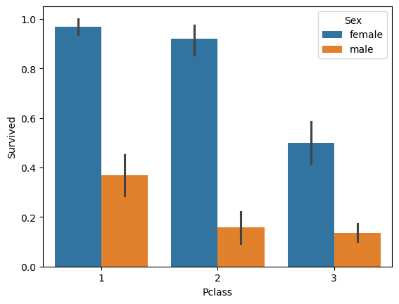

# Titanic

The data is from a beginning Kaggle competition to predict survivors of the famous Titanic disaster. On April 14, 1912, during its maiden voygage, the Titanic hit an iceberg and sank. Only 706 out of 2,240 passengers survived (31.5%). Data from a Kaggle competition is provided on 1,374 passengers, split between into training (n=892) and test (n=481) data sets. The survival status is only given with the training data. The challenge is to develop a model from this training set to predict who among the test data set would survive. 

The final model had an accuracy of 0.78229, which places it as #2531 out of 13,327 entries. 

## Initial review of data

List of variables
* Survival	0 = No, 1 = Yes
* pclass: Ticket class	1 = 1st, 2 = 2nd, 3 = 3rd
* sex	Sex	
* Age	Age in years	
* sibsp	# of siblings or spouses aboard the Titanic	
* parch	# of parents or children aboard the Titanic	
* ticket	Ticket number	
* fare	Passenger fare	
* cabin	Cabin number	
* embarked	Port of Embarkation	C = Cherbourg, Q = Queenstown, S = Southampton

Variable Notes
* pclass: A proxy for socio-economic status (SES) 1st = Upper, 2nd = Middle, 3rd = Lower
* age: Age is fractional if less than 1. If the age is estimated, is it in the form of xx.5
* sibsp: Includes brother, sister, stepbrother, stepsister, husband, wife (mistresses and fiancés were ignored)
* parch: Includes mother, father, daughter, son, stepdaughter, stepson. Some children travelled only with a nanny, therefore parch=0 for them.

### First 10 rows of dataframe

<table border="1" class="dataframe">
  <thead>
    <tr style="text-align: right;">
      <th></th>
      <th>PassengerId</th>
      <th>Survived</th>
      <th>Pclass</th>
      <th>Name</th>
      <th>Sex</th>
      <th>Age</th>
      <th>SibSp</th>
      <th>Parch</th>
      <th>Ticket</th>
      <th>Fare</th>
      <th>Cabin</th>
      <th>Embarked</th>
    </tr>
  </thead>
  <tbody>
    <tr>
      <th>0</th>
      <td>1</td>
      <td>0</td>
      <td>3</td>
      <td>Braund, Mr. Owen Harris</td>
      <td>male</td>
      <td>22.0</td>
      <td>1</td>
      <td>0</td>
      <td>A/5 21171</td>
      <td>7.2500</td>
      <td>NaN</td>
      <td>S</td>
    </tr>
    <tr>
      <th>1</th>
      <td>2</td>
      <td>1</td>
      <td>1</td>
      <td>Cumings, Mrs. John Bradley (Florence Briggs Th...</td>
      <td>female</td>
      <td>38.0</td>
      <td>1</td>
      <td>0</td>
      <td>PC 17599</td>
      <td>71.2833</td>
      <td>C85</td>
      <td>C</td>
    </tr>
    <tr>
      <th>2</th>
      <td>3</td>
      <td>1</td>
      <td>3</td>
      <td>Heikkinen, Miss. Laina</td>
      <td>female</td>
      <td>26.0</td>
      <td>0</td>
      <td>0</td>
      <td>STON/O2. 3101282</td>
      <td>7.9250</td>
      <td>NaN</td>
      <td>S</td>
    </tr>
    <tr>
      <th>3</th>
      <td>4</td>
      <td>1</td>
      <td>1</td>
      <td>Futrelle, Mrs. Jacques Heath (Lily May Peel)</td>
      <td>female</td>
      <td>35.0</td>
      <td>1</td>
      <td>0</td>
      <td>113803</td>
      <td>53.1000</td>
      <td>C123</td>
      <td>S</td>
    </tr>
    <tr>
      <th>4</th>
      <td>5</td>
      <td>0</td>
      <td>3</td>
      <td>Allen, Mr. William Henry</td>
      <td>male</td>
      <td>35.0</td>
      <td>0</td>
      <td>0</td>
      <td>373450</td>
      <td>8.0500</td>
      <td>NaN</td>
      <td>S</td>
    </tr>
    <tr>
      <th>5</th>
      <td>6</td>
      <td>0</td>
      <td>3</td>
      <td>Moran, Mr. James</td>
      <td>male</td>
      <td>NaN</td>
      <td>0</td>
      <td>0</td>
      <td>330877</td>
      <td>8.4583</td>
      <td>NaN</td>
      <td>Q</td>
    </tr>
    <tr>
      <th>6</th>
      <td>7</td>
      <td>0</td>
      <td>1</td>
      <td>McCarthy, Mr. Timothy J</td>
      <td>male</td>
      <td>54.0</td>
      <td>0</td>
      <td>0</td>
      <td>17463</td>
      <td>51.8625</td>
      <td>E46</td>
      <td>S</td>
    </tr>
    <tr>
      <th>7</th>
      <td>8</td>
      <td>0</td>
      <td>3</td>
      <td>Palsson, Master. Gosta Leonard</td>
      <td>male</td>
      <td>2.0</td>
      <td>3</td>
      <td>1</td>
      <td>349909</td>
      <td>21.0750</td>
      <td>NaN</td>
      <td>S</td>
    </tr>
    <tr>
      <th>8</th>
      <td>9</td>
      <td>1</td>
      <td>3</td>
      <td>Johnson, Mrs. Oscar W (Elisabeth Vilhelmina Berg)</td>
      <td>female</td>
      <td>27.0</td>
      <td>0</td>
      <td>2</td>
      <td>347742</td>
      <td>11.1333</td>
      <td>NaN</td>
      <td>S</td>
    </tr>
    <tr>
      <th>9</th>
      <td>10</td>
      <td>1</td>
      <td>2</td>
      <td>Nasser, Mrs. Nicholas (Adele Achem)</td>
      <td>female</td>
      <td>14.0</td>
      <td>1</td>
      <td>0</td>
      <td>237736</td>
      <td>30.0708</td>
      <td>NaN</td>
      <td>C</td>
    </tr>
  </tbody>
</table>
</div>


### Distributions of variables


<table border="1" class="dataframe">
  <thead>
    <tr style="text-align: right;">
      <th></th>
      <th>PassengerId</th>
      <th>Survived</th>
      <th>Pclass</th>
      <th>Name</th>
      <th>Sex</th>
      <th>Age</th>
      <th>SibSp</th>
      <th>Parch</th>
      <th>Ticket</th>
      <th>Fare</th>
      <th>Cabin</th>
      <th>Embarked</th>
    </tr>
  </thead>
  <tbody>
    <tr>
      <th>count</th>
      <td>891.000000</td>
      <td>891.000000</td>
      <td>891.000000</td>
      <td>891</td>
      <td>891</td>
      <td>714.000000</td>
      <td>891.000000</td>
      <td>891.000000</td>
      <td>891</td>
      <td>891.000000</td>
      <td>204</td>
      <td>889</td>
    </tr>
    <tr>
      <th>unique</th>
      <td>NaN</td>
      <td>NaN</td>
      <td>NaN</td>
      <td>891</td>
      <td>2</td>
      <td>NaN</td>
      <td>NaN</td>
      <td>NaN</td>
      <td>681</td>
      <td>NaN</td>
      <td>147</td>
      <td>3</td>
    </tr>
    <tr>
      <th>top</th>
      <td>NaN</td>
      <td>NaN</td>
      <td>NaN</td>
      <td>Braund, Mr. Owen Harris</td>
      <td>male</td>
      <td>NaN</td>
      <td>NaN</td>
      <td>NaN</td>
      <td>347082</td>
      <td>NaN</td>
      <td>B96 B98</td>
      <td>S</td>
    </tr>
    <tr>
      <th>freq</th>
      <td>NaN</td>
      <td>NaN</td>
      <td>NaN</td>
      <td>1</td>
      <td>577</td>
      <td>NaN</td>
      <td>NaN</td>
      <td>NaN</td>
      <td>7</td>
      <td>NaN</td>
      <td>4</td>
      <td>644</td>
    </tr>
    <tr>
      <th>mean</th>
      <td>446.000000</td>
      <td>0.383838</td>
      <td>2.308642</td>
      <td>NaN</td>
      <td>NaN</td>
      <td>29.699118</td>
      <td>0.523008</td>
      <td>0.381594</td>
      <td>NaN</td>
      <td>32.204208</td>
      <td>NaN</td>
      <td>NaN</td>
    </tr>
    <tr>
      <th>std</th>
      <td>257.353842</td>
      <td>0.486592</td>
      <td>0.836071</td>
      <td>NaN</td>
      <td>NaN</td>
      <td>14.526497</td>
      <td>1.102743</td>
      <td>0.806057</td>
      <td>NaN</td>
      <td>49.693429</td>
      <td>NaN</td>
      <td>NaN</td>
    </tr>
    <tr>
      <th>min</th>
      <td>1.000000</td>
      <td>0.000000</td>
      <td>1.000000</td>
      <td>NaN</td>
      <td>NaN</td>
      <td>0.420000</td>
      <td>0.000000</td>
      <td>0.000000</td>
      <td>NaN</td>
      <td>0.000000</td>
      <td>NaN</td>
      <td>NaN</td>
    </tr>
    <tr>
      <th>25%</th>
      <td>223.500000</td>
      <td>0.000000</td>
      <td>2.000000</td>
      <td>NaN</td>
      <td>NaN</td>
      <td>20.125000</td>
      <td>0.000000</td>
      <td>0.000000</td>
      <td>NaN</td>
      <td>7.910400</td>
      <td>NaN</td>
      <td>NaN</td>
    </tr>
    <tr>
      <th>50%</th>
      <td>446.000000</td>
      <td>0.000000</td>
      <td>3.000000</td>
      <td>NaN</td>
      <td>NaN</td>
      <td>28.000000</td>
      <td>0.000000</td>
      <td>0.000000</td>
      <td>NaN</td>
      <td>14.454200</td>
      <td>NaN</td>
      <td>NaN</td>
    </tr>
    <tr>
      <th>75%</th>
      <td>668.500000</td>
      <td>1.000000</td>
      <td>3.000000</td>
      <td>NaN</td>
      <td>NaN</td>
      <td>38.000000</td>
      <td>1.000000</td>
      <td>0.000000</td>
      <td>NaN</td>
      <td>31.000000</td>
      <td>NaN</td>
      <td>NaN</td>
    </tr>
    <tr>
      <th>max</th>
      <td>891.000000</td>
      <td>1.000000</td>
      <td>3.000000</td>
      <td>NaN</td>
      <td>NaN</td>
      <td>80.000000</td>
      <td>8.000000</td>
      <td>6.000000</td>
      <td>NaN</td>
      <td>512.329200</td>
      <td>NaN</td>
      <td>NaN</td>
    </tr>
  </tbody>
</table>
</div>


    

   
  

    
    

    


    

    


    

    


    

    


    

    


    

    


```python
missing_values=titanic.isnull().sum()
print(missing_values)
```

    PassengerId      0
    Survived         0
    Pclass           0
    Name             0
    Sex              0
    Age            177
    SibSp            0
    Parch            0
    Ticket           0
    Fare             0
    Cabin          687
    Embarked         2
    dtype: int64
    


```python
titanic.info()
```

    <class 'pandas.core.frame.DataFrame'>
    RangeIndex: 891 entries, 0 to 890
    Data columns (total 12 columns):
     #   Column       Non-Null Count  Dtype  
    ---  ------       --------------  -----  
     0   PassengerId  891 non-null    int64  
     1   Survived     891 non-null    int64  
     2   Pclass       891 non-null    int64  
     3   Name         891 non-null    object 
     4   Sex          891 non-null    object 
     5   Age          714 non-null    float64
     6   SibSp        891 non-null    int64  
     7   Parch        891 non-null    int64  
     8   Ticket       891 non-null    object 
     9   Fare         891 non-null    float64
     10  Cabin        204 non-null    object 
     11  Embarked     889 non-null    object 
    dtypes: float64(2), int64(5), object(5)
    memory usage: 83.7+ KB
    


## Explore bivariate relationships and how to handle missing values

First explore whether we should replace missing values of age based on sex. The analysis suggests we should. Missing values for sex are recoded as the mean for each sex.
   


Next, while the particular cabin does not appear to relate to survival, having a cabin assigned does appear to predict survival.  Those assigned a cabin were much more likely to survive than those that were not. Cabin is recoded as a dichotomous variable reflecting assignment or not. Embarked is recoded into into dummy variable to reflect Cherbourg with value of 1 and others with value of 0.

|Assigned a cabin?  | Survived |
| ------------- | ------------- |
|No  | 30.0%  |
| Yes  | 66.7% |

    

There does appear to be a relationship between where the passenger embarked from and survival. Passengers who embarked from Cherbourg (C) were more likely to survive than those embraking from Queenstown (Q) or Southahmpton(S).

|Embarked  | Survived |
| ------------- | ------------- |
|Cherbourg | 55.4%  |
|Queenstown  | 40.0% |
|Southahampton | 33.7% |

Passengers in first were more likely to survive than those in second class. Passengers in second class were more likely to survive than those in third class. 

|Class | Survived |
| ------------- | ------------- |
|First | 70.0%  |
|Second  | 47.2% |
|Third | 24.2% |

   
While sex is expected to relate to survival, it appears that there is also an interaction effect between class, sex, and survival.
   

    
Higher fares, in general, are related to higher survival.


    
Family relationships appear related to survival  Those who survived had fewer siblings and spouses but more parents / children. 
   

      

    
Is there an interaction effect between the variables of SibSp and Parch and survival. The heat map suggests not.
   


I examien the relationship between age and surviving. Age is divided into deciles and plotted against survival. 
    

    
It looks like the very young and very old are more likely to survive but the highest category of age has only one case. We create a dummy variable (child) to represent those aged 0.3 to 8.4 years.

|Age Range | Survived |
| ------------- | ------------- |
|0.3 - 8.4 yrs | 66.7%  |
|8.4 - 16.3 yrs | 41.3% |
|16.3 - 24.3 yrs | 35.6% |
|24.3 - 32.3 yrs | 33.8% |
|32.3 - 40.2 yrs | 44.1% |
|40.2 - 48.2 yrs | 34.3% |
|48.2 - 56.1 yrs | 46.7% |
|56.1 - 64.1 yrs | 37.5% |
|64.1 - 72.0 yrs | 0.0% |
|72.0 - 80.0 yrs | 50.0% |

## Modeling survival on the Titanic

Based on the exploratory data analysis, the model predicting survival on the Titanic will include the following variables:
* Pclass: Original coding as first, second, or third class.
* Sex: Recoded as numeric variable, 1=female, 0=male.
* Sibsp: Original coding as number of siblings and/or spouse.
* Parch: Original coding as number of parents and/or children.
* Cabinassign_code: Cabin recoded as dichotomous variable, 1=cabin assigned, 0=no cabin assigned.
* Cherbourg: Recoding of embarked as dichotomous variables, 1=departed from Cherbourg, 0=departed from another city. 2 missing values for embarked are dropped.
* Child: Age recoded as dichotomous variable 1=ages 0.34-84 years or 0=all others.
* Series of six dichotous variables capturing the interaction between class and sex.

All variables are transformed using StandardScaler to have a mean of 0 and standard deviation of 1 (essentially a z-score). Four different approaches are used. For each (except for k nearest neighbor), a model is ran with out tuniNG and with tuning. Tuning includes cross-validation dividing up the training model in to five groups. 

Logistic regression and random forest models share the same best tuning parameters with a low regularzation parameter, indicating a more generlizable model, with a lasso regression. The support vector machine model has a high regularization parameter indicating a tighter fit to the training data at a potential sacrifice of generalizability. The choice of number of neighboring values in KNN effectively is the tuning parameter and k=5 was selected versus models with k=3 or k=10 neighbors. The coefficients are listed below for the logistic regressionw with tuning parameteres and are helpful for indicating the relative strength of each predictor in the model. As expected, sex is the strongest value followed by an interaction of class and gender. The child variable performs as the next strongest predictor outside of sex and sex by class interactions. Essentially the official direction during the Titanic disaster to save women and children first is reflected in the data but with somewhat different impact depending on the ticket class of the woman or child.

| Model | Accuracy | Notes |
| --- | --- | --- |
| logistic regression | 0.76794 | |
| logistic regression w/ tuning| 0.78229 |Best parameters: {'C': 0.01, 'penalty': 'l2', 'solver': 'lbfgs'} |
| random forest | 0.76076 | |
| random forest w/ tuning | 0.76794 |Best parameters: {'C': 0.01, 'penalty': 'l2', 'solver': 'lbfgs' |
| k nearest neighbor | 0.77511 | Highest accuracy for K=5 |
| support vector machine | 0.77272 | |
| support vector machine w/ tuning | 0.75358 | Best parameters: {'C': 10, 'gamma': 'scale', 'kernel': 'rbf'}|

| Predictor | Coefficient |
| --- | --- |
| Pclass | -0.19|
| Sex | 0.43|
| Sibsp | -0.07|
| Parch | 0.09|
| Cabinassign_code | 0.21|
| Cherbourg | 0.13|
| Child | 0.23|
| Female, First Class | 0.30
| Female, Second Class | 0.35|
| Female, Third Class | 0.04
| Male, First Class | -0.10|
| Male, Second Class | -0.17|
| Male, Third Class | -0.24|
| Intercept | -0.54|


